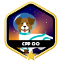
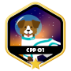
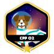
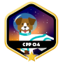

# Hi everyone, I'm Daniel Trigo.

I'm Daniel Trigo, but my nickname is willtrigo, because of a joke in school that I've carried since then. I've been programming since 2006 and have had the opportunity to work in education, developing educational games, digital media, animations, and I've also worked with intelligent kiosks developing mobile solutions. Currently, I'm studying software engineering at 42sp in Brazil. I'm challenging myself to deepen my understanding of C and Unix, as that is the core of the 42 school curriculum.

## 📩 Contact me:

	
	
	
	

## ⌨ Programming Languages

<picture>
  
</picture>

## 🌐 Web Development

<picture>
  
</picture>

## 🛢 Databases

<picture>
  
</picture>

## 🧰 DevOps & Tools

<picture>
  
</picture>

## 📝 IDEs & Editors

<picture>
  
</picture>

## 🏗 Build Tools & Package Managers

<picture>
  
</picture>

## 🔥 GitHub Stats:

<picture>
	
</picture>
<picture>
	
</picture>

 

## 🏅 42sp Projects Badges:

	

		<picture>
			
		</picture>
	

	<picture>
		
	</picture>

	<picture>
		
	</picture>

	<picture>
		
	</picture>

	<picture>
		
	</picture>

	<picture>
		
	</picture>

<h2></h2>

<picture>
	
</picture>

	<picture>
		<source srcset="./img/wild_duck.png" media="(min-height: 40px)">
		<source srcset="./img/wild_duck.png" media="(min-height: 30px)">
		
	</picture>

